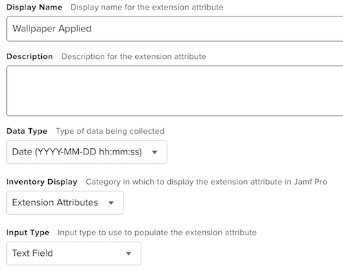
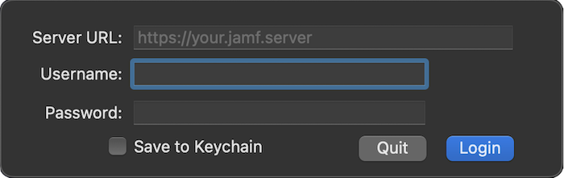
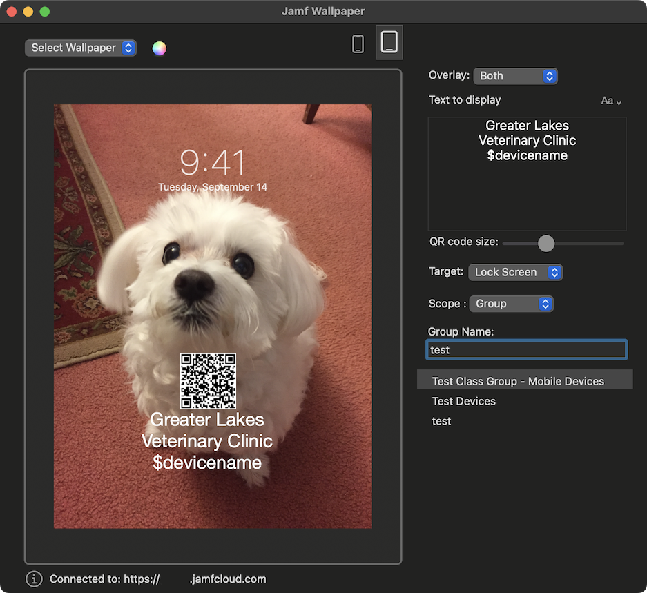
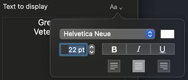
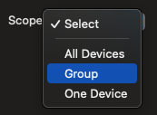

# Jamf Wallpaper

This app helps you set customized background images to iOS/iPadOS devices managed by Jamf Pro. You can overlay custom text and/or QR Code for each device. 

Download: [Jamf Wallpaper](https://github.com/jamf/wallpaper/releases/latest/download/wallpaper.zip)

Test your setting on a variety of test devices prior to sending to an entire fleet. You may wish to do rollouts in phases. Image processing for a large fleet will take some time and server resources. 

## Setup

The following Jamf Pro permissions are required to set wallpaper: 
<table border="1">
  <tr>
    <td>Jamf Pro Server Objects</td>
    <td>Mobile Devices: Create, Read, Update</td>
  </tr>
  <tr>
    <td>Jamf Pro Server Actions</td>
    <td>Send Mobile Device Set Wallpaper Command</td>
  </tr>
</table> 

To help track which devices have had a wallpaper deployed (and which haven't) along with when, create a mobile devices extension attribute. Go to Settings --> Device Management --> Extension Attributes, then click New. Create the attribute using the following: 
  <b>- Display Name:</b> Wallpaper Applied 
  <b>- Data Type:</b> Date (YYYY-MM-DD hh:mm:ss) 
  <b>- Inventory Display:</b> select the category you feel is most appropriate 
  <b>- Input Type:</b> Text Field 

For example.

## Startup
When you launch the program, you will be prompted to login to you Jamf Pro Server.

## The Preview area

To set a wallpaper, select an image file (.jpeg or .png format) from the drop-down menu or select a solid color using the color wheel. Your image/color will appear in the preview area. You can swap the preview between iPhone and iPad views. 

***Note**:* You can drag the QR code and text box within the preview display to set their position. Holding the shift key while dragging will center the object (QR code or text box) horizontally. 

| Image sizing notes: |
|:----------|
| When using a custom image file, the best resolution will depend on the device model and your image's level of detail. iOS devices will automatically size/crop the image to achieve a good fit, maintaining aspect ratio. 
Use the smallest image size that achieves acceptable appearance to improve performance. Aspect ratio and resolution vary by device. https://www.ios-resolution.com is a useful reference. 
On iPad, wallpaper will rotate, so a square image may be preferred. For additional information about device resolution/aspect ratios see Apple’s Human Interface Guidelines. |

## OPTIONS

**Overlay:** 
You may add text and/or a QR code to the wallpaper. 

**Text to display:** 
Enter any text you want to overlay. The text may be formatted using the format dropdown…

The following payload variables are supported within the text field: 
- $devicename 
- $serialnumber 
- $sitename 
- $asset_tag 
- $buildingname 
- $departmentname 

**Target:** 
You can set the wallpaper on *Lock Screen*, *Home Screen*, or *Both*. You can send multiple commands to your devices. For example, you might set a lock screen image that includes a QR code to the Lock Screen, and then send the same image without the QR code to the home screen. 
  
**Scope:**  Use the Scope button select the device(s) you wish to target. If you select *Group* or *One Device*, a list of filterable options will appear. 

**The "Set Background" button:** 
The app will send your request to Jamf Pro when you click this button. A dialog summarizing the operation will appear once the app finishes communicating with Jamf Pro. 

Information about the process can be viewed in the app log, available by typing command + L or from the menu bar, View --> Logs Folder.
